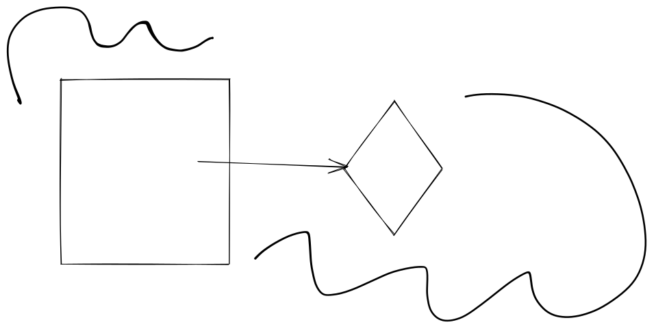

# Content test page

### Text

The **quick** _brown_ _**fox**_ <mark style="color:green;">jumps</mark> `over` ~~the~~ lazy [dog](https://en.wikipedia.org/wiki/The\_quick\_brown\_fox\_jumps\_over\_the\_lazy\_dog)

* This is
* a list

link to internal file [../SUMMARY.md](../../SUMMARY.md)

> This is a quote by a famous person


This is a warning


### Code

`this is some basic code`


```javascript
// this is a sample code block
var greeting = "hello world!"
console.log(greeting);
```



```html
<html>
<head></head>
<body>
    <h1>Hello world!</h1>
</body>
</html>
```



```bash
# view any changes to files
git status
# stage all new or changed files  
git add .
# commit all changes
git commit -m "First commit"
# push changes to the remote (Github)
git push
```



An example Codepen embed


### Media

A youtube video




